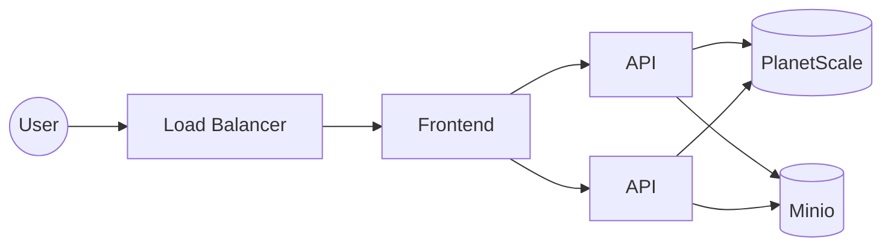

# report-central

## Description

Golang Fiber API with frontend to manage all kind of reports with a simple UI.
Artifact information and respective reports are stored in a PlanetScale Database and the reports are stored in a Minio bucket or any other S3 compatible storage.

Can be run locally or deployed to a Kubernetes cluster, as an Helm chart is provided.

## Architecture
Really simple architecture, with a frontend, two APIs, a load balancer, a Minio instance and a PlanetScale instance.

## Deployment

When deployed with the helmchart, a database deployment is created, with a service and a secret for the database credentials.
An S3 compatible storage is needed to run the app, so if not using minio configure the `values.yaml` file with the correct credentials.

## Metrics

Metrics are exposed in the `/metrics` endpoint, and can be scraped by Prometheus, more information in the [Prometheus documentation](https://prometheus.io/docs/prometheus/latest/getting_started/) and in [Metrics doc](./docs/metrics.md).