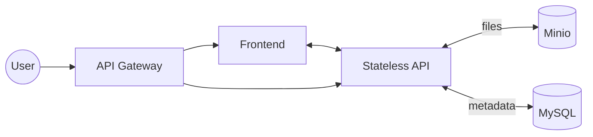

# report-central

## Description

Golang Fiber API with frontend to manage all kind of reports with a simple UI.
Artifact information and respective reports are stored in a MySQL Database and the reports contents are stored in a Minio bucket or any other S3 compatible storage.

Can be run locally or deployed to a Kubernetes cluster, as an Helm chart **will be** provided.

## Architecture
Simple architecture with a frontend, two APIs, a load balancer, a Minio instance and a MySQL instance.

## Deployment

When deployed with the helmchart, a database deployment is created, with a service and a secret for the database credentials.
An S3 compatible storage is needed to run the app, so if not using minio configure the `values.yaml` file with the correct credentials.

## Metrics

Metrics are exposed in the `/metrics` endpoint, and can be scraped by Prometheus, more information in the [Prometheus documentation](https://prometheus.io/docs/prometheus/latest/getting_started/) and in [Metrics doc](./docs/metrics.md).

## Roadmap

### Essentials
- [ ] CI Pipeline
- [ ] Unit tests
- [ ] Integration tests

### Fiber API
- [x] CRUD for artifacts
- [ ] CRUD for reports
- [x] Write reports to S3 compatible storage
- [x] Read reports from S3 compatible storage
- [ ] /metrics exposure
- [ ] Healthcheck endpoint
- [ ] API documentation

### Frontend
- [ ] TO-DO

### Misc
- [ ] User authentication middleware
- [ ] RBAC for artifact access
- [ ] Helm chart

## Running locally

In order to run locally you'll need to have a MySQL instance running, and a Minio instance running.
You can use the provided [docker-compose file](./compose/infra.yaml) files to run both.
Be sure to create a **.env** file with the correct credentials for the database and the Minio instance.